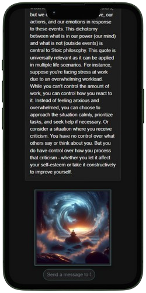

# StoicOpenAI Frontend

## Overview
The frontend of StoicOpenAI presents a responsive web application where users can explore Stoic wisdom through quotes and AI-generated visuals.

## Live Demo
- To experience StoicOpenAI firsthand and explore its full range of features, try the demo [Here](https://stoicopenai.sadekdev.com).

## Features

### Quote Generation
- Users can input their current emotions or situations to receive tailored Stoic quotes.
- The application processes the input and fetches five relevant quotes from Stoic philosophers.

### In-depth Explanation
- Users can select a quote to get a more detailed explanation.
- The application provides historical and philosophical context, making the wisdom accessible, practical and how it applies to everyday life with for example analogies.

### AI Art Visualization
- Accompanying each explanation is a unique piece of AI-generated artwork that captures the essence of the chosen quote.
- This visual representation serves to inspire and offer comfort.

### AI Generated Art
Disclaimer: Please note that the AI-generated content may occasionally produce unexpected or nonsensical results. I am working on refining the prompts and improving the overall accuracy and relevancey of the generated images and quotes.

 

*The image portrays the contrast between external serenity and internal turmoil, embodying the Stoic view that our inner reactions shape our reality, regardless of outside influences. It visualizes the concept that peace is not about our surroundings, but about our internal resilience and perception.*

### Responsive Design
- The webapp is fully responsive, providing a seamless experience across various devices and screen sizes.

#### Mobile View

## Getting Started
To run this project locally:

1. Clone the repository: `https://github.com/sadekkk12/StoicOpenAI_frontend.git`
2. Install dependencies: `npm install` (Make sure Node.js and npm are installed)
3. Run the development server: `npm start` or use the Live Server extension in VSCode.
4. Build for production: `npm run build`

## Technology Stack
- HTML, CSS, and JavaScript with Bootstrap for responsive design
- Integration with the backend RESTful API

## Design
The application uses a dark theme that embodies the essence of Stoicism with a color scheme that includes shades like `#1e3f4a`.

## Deployment
The frontend is hosted on Azure Static Web Apps, automatically updated via GitHub Actions upon new commits to the main branch.

## Related Repositories
- https://github.com/sadekkk12/StoicOpenAI_backend.git
