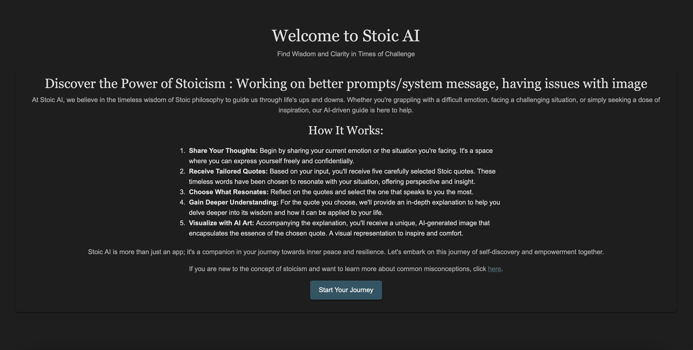
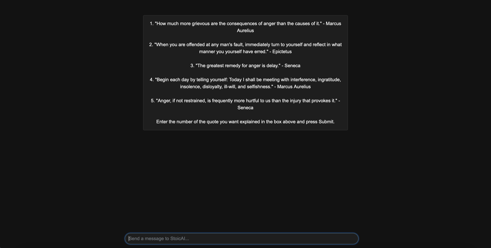
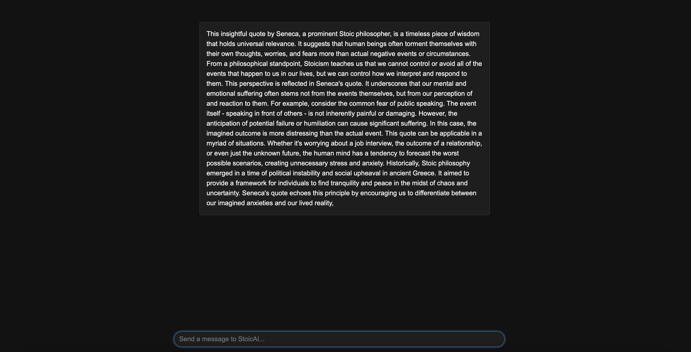
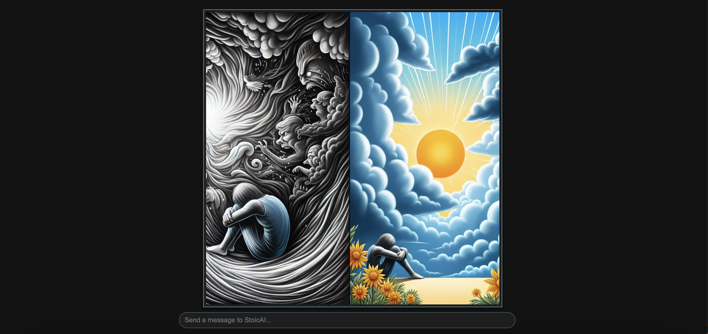

# StoicOpenAI Frontend

## Overview
The frontend of StoicOpenAI presents a responsive web application where users can explore Stoic wisdom through quotes and AI-generated visuals.

## Live Demon
- X

## Screenshots
Here are some screenshots showcasing the application's main features and user interface:

### Introduction Page

### Quote Generation

### Detailed Explanation View

### AI Generated Art
Disclaimer: can generate faulty or nonsensicle images at times.

## Getting Started
To run this project locally:

1. Clone the repository: `https://github.com/sadekkk12/StoicOpenAI_frontend.git`
2. Install dependencies: `npm install` (Make sure Node.js and npm are installed)
3. Run the development server: `npm start` or use the Live Server extension in VSCode.
4. Build for production: `npm run build`

## Technology Stack
- HTML, CSS, and JavaScript with Bootstrap for responsive design
- Integration with the backend RESTful API

## Design
The application uses a dark theme that embodies the essence of Stoicism with a color scheme that includes shades like `#1e3f4a`.

## Deployment
The frontend is hosted on Azure Static Web Apps, automatically updated via GitHub Actions upon new commits to the main branch.

##Related Repositories
- https://github.com/sadekkk12/StoicOpenAI_backend.git
